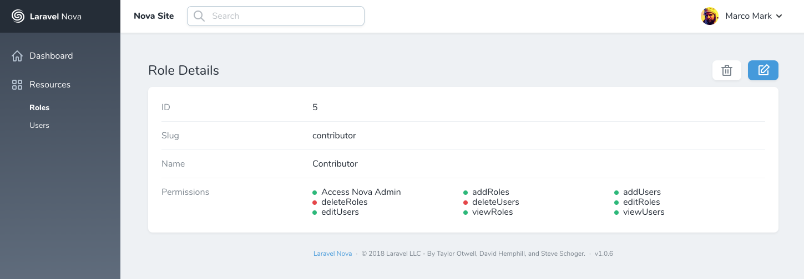
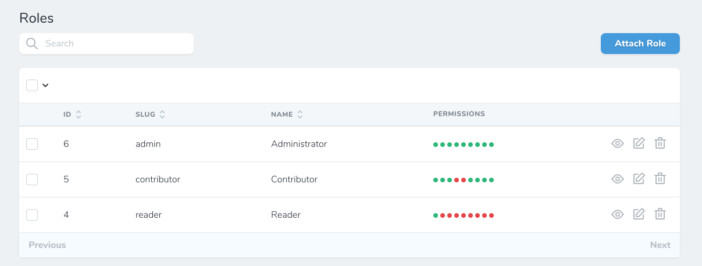

# Laravel Nova Checkboxes Field






## Installation

`composer require silvanite/novafieldcheckboxes`

## Usage

```php
use Silvanite\NovaFieldCheckboxes\Checkboxes;

Checkboxes::make('Permissions')->options([
    'viewNova' => 'Access Admin UI',
    'manageUsers' => 'Manage Users',
]),
```

## Configuration

You can customise how the values from checkbox fields are passed to your scripts. By default it's will cast all numeric keys to floats or integers, e.g. `[1, 2, 3]` instead of `["1", "2", "3"]`. You can save disable this feature by calling `withoutTypeCasting()` to have the original array keys returned unmodified.

```php
use Silvanite\NovaFieldCheckboxes\Checkboxes;

Checkboxes::make('Permissions')->options([
    1 => 'Access Admin UI',
    2 => 'Manage Users',
])->withoutTypeCasting(),
```

You can also customise the number of columns in which options will be displayed by calling `columns()`

```php
use Silvanite\NovaFieldCheckboxes\Checkboxes;

Checkboxes::make('Permissions')->options([
    1 => 'Access Admin UI',
    2 => 'Manage Users',
])->columns(4),
```

### Example using eloquent

Here is an example of how you might use an eloquent model with Checkboxes.

```php
use Silvanite\NovaFieldCheckboxes\Checkboxes;

Checkboxes::make('users')
    ->options(App\User::pluck('name', 'id'))
    ->withoutTypeCasting(),
```

## Support

If you require any support please contact me on [Twitter](https://twitter.com/m2de_io) or open an issue on this repository.

## License

MIT
